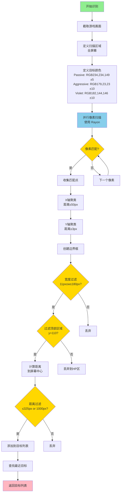
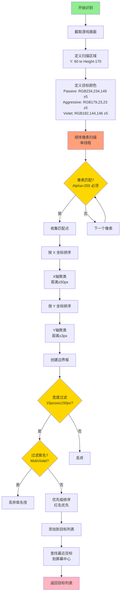
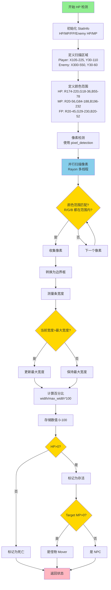
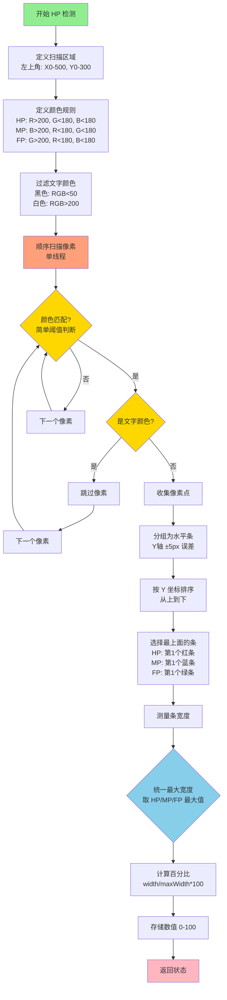
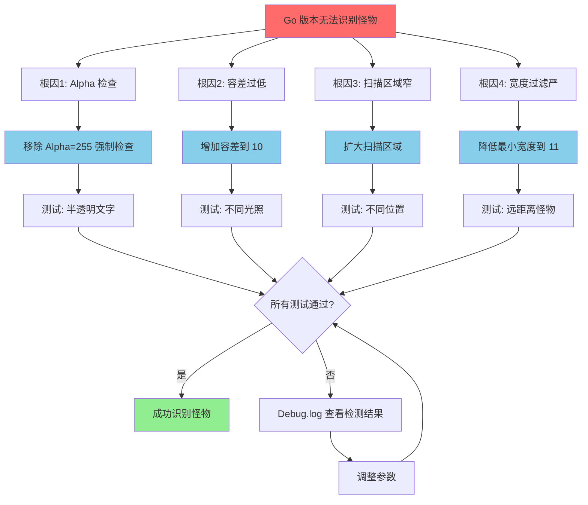

# Flyff Bot - Go 程序架构文档

## 概述

这是一个为 Flyff Universe 游戏设计的自动化机器人程序，使用 Go 语言编写，通过 chromedp 控制浏览器，实现图像识别、自动战斗、状态监控等功能。

## 核心特性

- ✅ **异步架构**：浏览器、识别、行为系统完全异步运行
- ✅ **实时图像识别**：HP/MP/FP 状态栏、怪物名称检测
- ✅ **智能颜色识别**：基于颜色范围的灵活检测（过滤文字）
- ✅ **系统托盘界面**：通过托盘菜单配置所有设置
- ✅ **调试可视化**：在游戏画面上绘制识别区域和检测结果
- ✅ **持久化存储**：配置和 cookies 自动保存到 data.json

---

## 文件结构

```
flyff/
├── main.go          # 程序入口、Bot 控制器、主循环
├── browser.go       # Chromedp 浏览器控制、截图、overlay 绘制
├── tray.go          # 系统托盘 UI、菜单处理
├── platform.go      # 跨平台接口：鼠标、键盘、像素扫描
├── data.go          # 数据结构：Point、Bounds、Color、Config、Stats
├── analyzer.go      # 图像分析：状态栏识别、怪物检测
├── behavior.go      # 行为实现：Farming、Support
├── movement.go      # 移动协调：攻击、治疗、移动控制
├── persistence.go   # 数据持久化：保存/加载 JSON
├── utils.go         # 日志系统、计时器、工具函数
├── data.json        # 持久化数据（配置+cookies）
└── Debug.log        # 运行日志（每次启动清空）
```

---

## 程序架构

### 1. 协程架构

程序采用多协程异步设计，各组件独立运行：

```
主线程
  └─ systray.Run() [阻塞]
      └─ onReady()
          │
          ├─ [协程1] 浏览器启动（异步）
          │   ├─ browser.Start()
          │   │   └─ 设置 cookies
          │   │   └─ [协程1.1] 后台导航
          │   │       └─ chromedp.Navigate() [60秒超时]
          │   └─ isReady = true (立即标记)
          │
          ├─ [协程2] 主循环（立即启动）
          │   └─ mainLoop()
          │       └─ 每 captureInterval 执行一次
          │           └─ runIteration()
          │               ├─ Capture() [5秒超时]
          │               ├─ UpdateStats() [识别HP/MP/FP]
          │               ├─ IdentifyMobs() [识别怪物]
          │               ├─ DrawDebugOverlay() [2秒超时]
          │               ├─ behavior.Run() [执行行为]
          │               └─ UpdateStatus() [更新托盘]
          │
          └─ [协程3+] 托盘事件处理
              ├─ handleEvents() [模式切换]
              ├─ handleSlotClick() x60 [技能槽配置]
              ├─ handleThresholdClick() x33 [阈值配置]
              └─ handleCaptureFreqClick() x5 [捕获频率]
```

**关键设计**：
- ✅ 浏览器和主循环**完全异步**，互不阻塞
- ✅ 浏览器加载慢不影响主循环启动
- ✅ 所有 chromedp 操作都有超时保护

---

### 2. 启动流程

```
00:00  程序启动
00:00  初始化日志（清空 Debug.log）
00:00  加载 data.json（配置+cookies）
00:00  创建 Bot 实例
00:00  启动系统托盘
00:00  ├─ 托盘 UI 就绪
00:00  ├─ Status: "Starting..."
00:00  └─ 触发 StartMainLoop()
00:00      ├─ [异步] 启动浏览器
00:00      │   ├─ 创建 chromedp context
00:00      │   ├─ 设置 cookies
00:00      │   ├─ isReady = true (立即)
00:00      │   └─ [后台] 导航到游戏 (60秒超时)
00:00      │
00:00      └─ [异步] 启动主循环 (立即)
00:01          └─ runIteration() 开始执行
00:60          └─ 浏览器导航完成/超时
```

**优势**：
- ⚡ 程序启动即可用（0秒等待）
- ⚡ Status 立即更新
- ⚡ 容错性强（浏览器失败不影响程序）

---

### 3. 主循环逻辑

#### mainLoop() - main.go:136-165

```go
for {
    // 检查是否需要执行
    if 到达捕获间隔 {
        runIteration()
        lastCaptureTime = now
    } else {
        time.Sleep(50ms)  // 防止忙等待
    }
}
```

#### runIteration() - main.go:168-214

```go
1. 检查浏览器是否就绪
2. 截取游戏画面 [Capture, 5秒超时]
3. 图像识别
   ├─ UpdateStats()    // HP/MP/FP 识别
   ├─ GetStats()       // 获取状态
   └─ IdentifyMobs()   // 怪物识别
4. 绘制调试 overlay [DrawDebugOverlay, 2秒超时]
5. 执行行为逻辑 [behavior.Run()]
6. 更新托盘状态 [UpdateStatus()]
```

**超时保护**：
- Capture: 5秒
- DrawDebugOverlay: 2秒
- Navigation: 60秒

---

### 4. 图像识别系统

#### 状态栏识别 - analyzer.go:166-282

**识别区域**：
```
左上角 (0, 0) → (500, 300)
```

**颜色识别规则**：
```go
HP (红色):  R > 200 && G < 180 && B < 180
MP (蓝色):  B > 200 && R < 180 && G < 180
FP (绿色):  G > 200 && R < 180 && B < 180

过滤文字:
- 黑色: R < 50 && G < 50 && B < 50
- 白色: R > 200 && G > 200 && B > 200
```

**识别流程**：
```
1. 扫描识别区域 (0,0)-(500,300)
2. 按颜色分类像素点
   ├─ hpPoints (红色像素)
   ├─ mpPoints (蓝色像素)
   └─ fpPoints (绿色像素)
3. 分组为水平条 [groupIntoHorizontalBars]
   └─ 允许 Y 轴 ±5px 误差
4. 按 Y 坐标排序（从上到下）
5. 取最上面的条作为结果
   ├─ HP: 最上面的红色条
   ├─ MP: 最上面的蓝色条
   └─ FP: 最上面的绿色条
6. 计算百分比
   └─ percentage = width / maxWidth * 100
7. MaxWidth 统一管理
   └─ 持续取 HP/MP/FP 中最大值
```

**避免 EXP 误识别**：
- ✅ 只取最上面的条
- ✅ EXP 在最下面，不会被选中

#### 怪物识别 - analyzer.go:59-125

**颜色配置**：
```go
Passive (黄色):  RGB(234, 234, 149) ± tolerance
Aggressive (红): RGB(179, 23, 23) ± tolerance
```

**识别流程**：
```
1. 扫描屏幕（忽略顶部/底部UI）
2. 检测匹配颜色的像素
3. 聚类像素点 [ClusterByDistance]
   ├─ X 轴距离 ≤ 50px
   └─ Y 轴距离 ≤ 3px
4. 过滤 Bounds
   └─ MinMobNameWidth ≤ width ≤ MaxMobNameWidth
5. 优先级排序
   ├─ 红名怪优先 (PrioritizeAggro = true)
   └─ 按距离排序
```

---

### 5. 浏览器控制系统

#### Capture - browser.go:140-195

```go
功能: 截取游戏画面
超时: 5 秒
返回: *image.RGBA
流程:
  1. 检查 isReady
  2. 检查 context 是否有效
  3. chromedp.CaptureScreenshot [5秒超时]
  4. 解码为 RGBA 图像
  5. 返回图像
```

#### DrawDebugOverlay - browser.go:251-546

```go
功能: 在游戏画面绘制调试信息
超时: 2 秒
内容:
  1. 状态栏识别区域 (黄色边框)
     └─ (0, 0) → (500, 300)

  2. 检测到的状态条 (绿色边框)
     ├─ HP 条 + 百分比
     ├─ MP 条 + 百分比
     └─ FP 条 + 百分比

  3. 怪物边框 (绿色)
     └─ 标注 "MOB1", "MOB2"...

  4. 状态面板 (左边 300px)
     ├─ 半透明黑色背景 (50%)
     ├─ 字体: 20px monospace
     └─ 内容:
         ├─ Mode (模式)
         ├─ Kills (击杀数)
         ├─ Mouse (X, Y) [canvas 相对坐标]
         ├─ HP/MP/FP (百分比 + 阈值)
         └─ 技能槽配置

  5. 行动日志 (状态面板下方)
     └─ 最近 5 条行动记录

方法: JavaScript 注入
  └─ chromedp.Evaluate() [2秒超时]
```

**鼠标坐标追踪**：
```javascript
// 在 canvas 上添加 mousemove 监听器
gameCanvas.addEventListener('mousemove', function(e) {
    const scaleX = gameCanvas.width / canvasRect.width;
    const scaleY = gameCanvas.height / canvasRect.height;
    window.flyffMousePos.x = Math.floor((e.clientX - left) * scaleX);
    window.flyffMousePos.y = Math.floor((e.clientY - top) * scaleY);
});
```

---

### 6. 系统托盘界面

#### 菜单结构 - tray.go

```
Flyff Bot
├─ Status: Mode: Farming | 0 kills | 0.0/min | 0s
├─ ─────
├─ Mode
│  ├─ Stop
│  ├─ Farming ✓
│  ├─ Support
│  └─ Shouting
├─ ─────
├─ Slots
│  ├─ Attack Slots
│  │  ├─ Slot 0 ✓
│  │  ├─ Slot 1
│  │  └─ ...
│  ├─ Heal Slots
│  ├─ Buff Slots
│  ├─ MP Restore Slots
│  ├─ FP Restore Slots
│  └─ Pickup Slots
├─ Thresholds
│  ├─ HP Threshold
│  │  ├─ 0%
│  │  ├─ 10%
│  │  ├─ ...
│  │  └─ 50% ✓
│  ├─ MP Threshold
│  └─ FP Threshold
├─ Capture Frequency
│  ├─ Continuous (0ms)
│  ├─ 1 Second ✓
│  ├─ 2 Seconds
│  ├─ 3 Seconds
│  └─ 4 Seconds
├─ Statistics (只读)
└─ Quit
```

#### Status 更新 - tray.go:259-267

```go
每次 runIteration 完成后更新:
  "Mode: Farming | 5 kills | 2.5/min | 2m30s"
```

---

### 7. 行为系统

#### Farming Behavior - behavior.go:25-186

```go
状态机:
  Idle → Searching → Attacking → Healing → Idle

流程:
  1. 检查生存
     └─ 死亡? → 等待复活

  2. 检查状态
     ├─ HP < threshold? → 使用治疗技能
     ├─ MP < threshold? → 使用 MP 药水
     └─ FP < threshold? → 使用 FP 药水

  3. 战斗循环
     ├─ 搜索目标 [IdentifyMobs]
     ├─ 选择最近目标
     ├─ 点击目标位置 (底部中心)
     ├─ 等待 200ms
     ├─ 循环使用攻击技能
     │   └─ 每个技能 100ms 间隔
     └─ 检查目标是否死亡
         └─ 无目标? → 记录击杀

  4. 拾取物品
     └─ 使用 pickup 技能
```

#### Support Behavior - behavior.go:188-285

```
功能: 跟随+治疗队友
状态: 未完全实现
```

---

### 8. 数据结构

#### Config - data.go:419-482

```go
type Config struct {
    Mode              string      // "Farming" | "Support" | "Stop"

    // 技能槽 (0-9)
    AttackSlots       []int
    HealSlots         []int
    BuffSlots         []int
    MPRestoreSlots    []int
    FPRestoreSlots    []int
    PickupSlots       []int

    // 阈值 (0-100, 10% 递增)
    HealThreshold     int
    MPThreshold       int
    FPThreshold       int

    // 怪物颜色
    PassiveColor      Color
    AggressiveColor   Color
    PassiveTolerance  uint8
    AggressiveTolerance uint8

    // 行为设置
    PrioritizeAggro   bool
    MinMobNameWidth   int
    MaxMobNameWidth   int

    // 捕获频率 (ms)
    CaptureInterval   int  // 0=连续, 1000=1秒
}
```

#### ClientStats - data.go:352-382

```go
type ClientStats struct {
    // 状态条
    HP, MP, FP        *StatusBar
    TargetHP, TargetMP *StatusBar

    // 检测到的条位置
    HPBar, MPBar, FPBar DetectedBar
    TargetHPBar       DetectedBar

    // 状态
    IsAlive           AliveState
    HasTarget         bool
    TargetIsAlive     bool
}

type StatusBar struct {
    MaxWidth          int   // 最大宽度 (像素)
    CurrentValue      int   // 当前百分比 (0-100)
}
```

#### Statistics - data.go:525-579

```go
type Statistics struct {
    StartTime         time.Time
    KillCount         int
    LastKillTime      time.Time
    TotalKillTime     time.Duration
    TotalSearchTime   time.Duration
}

方法:
  - AddKill(killTime, searchTime)
  - KillsPerMinute() float64
  - GetStats() (kills, kpm, kph, uptime)
```

---

### 9. 持久化系统

#### 数据格式 - data.json

```json
{
  "config": {
    "Mode": "Farming",
    "AttackSlots": [0],
    "HealSlots": [1],
    "MPRestoreSlots": [2],
    "FPRestoreSlots": [3],
    "PickupSlots": [4],
    "HealThreshold": 50,
    "MPThreshold": 30,
    "FPThreshold": 30,
    "CaptureInterval": 1000
  },
  "cookies": [
    {
      "name": "...",
      "value": "...",
      "domain": "universe.flyff.com",
      ...
    }
  ]
}
```

#### 保存时机

```go
1. 用户修改配置时 (立即保存)
   ├─ 切换模式
   ├─ 修改技能槽
   ├─ 修改阈值
   └─ 修改捕获频率

2. 程序退出时
   ├─ 保存配置
   └─ 保存 cookies
```

---

### 10. 日志系统

#### 日志级别 - utils.go:20-70

```
[DEBUG]  详细调试信息
[INFO]   常规信息
[WARN]   警告（不影响运行）
[ERROR]  错误（但程序继续）
```

#### 日志文件

```
位置: ./Debug.log
格式: 2025/10/20 23:18:21.150126 [INFO] Message
行为: 每次启动清空 (O_TRUNC)
```

#### 关键日志点

```
启动:
  - Logger initialized (log file cleared)
  - === Flyff Bot Started ===
  - Browser allocator context created
  - Main loop started

识别:
  - Status bar detection region: X=0 Y=0 W=500 H=300
  - HP: found N points, MP: found N points
  - HP: N bars, MP: N bars, FP: N bars

行为:
  - [behavior] Searching for targets
  - [behavior] Attacking target at (X, Y)
  - [behavior] Kill recorded

错误:
  - Navigation error: context deadline exceeded
  - Screenshot failed: ...
  - Failed to draw debug overlay: ...
```

---

## 配置说明

### 默认配置

```go
Mode:              "Farming"
AttackSlots:       [0]
HealSlots:         [1]
MPRestoreSlots:    [2]
FPRestoreSlots:    [3]
PickupSlots:       [4]
HealThreshold:     50%
MPThreshold:       30%
FPThreshold:       30%
CaptureInterval:   1000ms (1秒)
PrioritizeAggro:   true
MinMobNameWidth:   15px
MaxMobNameWidth:   150px
```

### 修改配置

通过系统托盘菜单修改，自动保存到 data.json

---

## 运行要求

### 系统要求

- **操作系统**: macOS, Windows, Linux
- **Go 版本**: 1.21+
- **Chrome/Chromium**: chromedp 自动管理

### 构建

```bash
cd flyff
go build -o flyff-bot
```

### 运行

```bash
./flyff-bot
```

### 停止

```bash
pkill flyff-bot
```

或通过托盘菜单 → Quit

---

## 故障排查

### 问题: Status 卡在 "Starting..."

**原因**: 主循环被阻塞

**排查**:
```bash
tail -50 Debug.log
```

查找:
- "UpdateStats: attempting to lock" 但没有 "lock acquired" → 死锁
- "runIteration: starting" 只出现一次 → 主循环卡住
- 没有 "Timer [main_loop]" → runIteration 未完成

**解决**: 检查是否有其他线程持有锁

### 问题: 浏览器导航超时

**日志**: `Navigation error: context deadline exceeded`

**原因**: 网络慢或页面加载慢

**解决**:
- 这是警告，不影响运行
- 可增加超时时间（browser.go:123）
- 检查网络连接

### 问题: 识别不到 HP/MP/FP

**排查**:
```
[DEBUG] HP: found 0 points, MP: found 0 points
```

**原因**:
1. 识别区域错误
2. 颜色阈值不匹配
3. 游戏 UI 位置变化

**解决**:
- 检查黄色边框位置（应该覆盖状态栏）
- 调整颜色识别规则（analyzer.go:310-317）

### 问题: Overlay 不显示

**原因**: JavaScript 执行失败或超时

**排查**:
```bash
grep "DrawDebugOverlay" Debug.log
```

**解决**:
- 检查浏览器 console
- 增加超时时间（browser.go:532）

---

## 性能指标

### 正常运行

```
主循环频率:    每秒 1 次（可配置）
识别耗时:      5-10ms
  ├─ UpdateStats:   1-2ms
  └─ IdentifyMobs:  3-5ms
绘制耗时:      50-100ms
总循环耗时:    60-120ms
CPU 占用:      5-10%
内存占用:      40-60MB
```

### 启动时间

```
托盘就绪:      0 秒
主循环启动:    0 秒
浏览器就绪:    1-60 秒（异步）
```

---

## 开发指南

### 添加新的识别功能

1. 在 `analyzer.go` 添加检测函数
2. 在 `runIteration()` 调用
3. 在 `DrawDebugOverlay()` 可视化

### 添加新的行为模式

1. 在 `behavior.go` 实现 `BotBehavior` 接口
2. 在 `ChangeMode()` 添加 case
3. 在托盘菜单添加选项

### 修改识别颜色

编辑 `analyzer.go:310-317`:
```go
case "hp":
    matched = pixel.R > 200 && pixel.G < 180 && pixel.B < 180
```

### 调整超时时间

```go
browser.go:123   // 导航: 60秒
browser.go:156   // 截图: 5秒
browser.go:532   // Overlay: 2秒
```

---

## 11. Rust 版本对比分析

### 11.1 怪物识别逻辑对比

#### Rust 版本 (neuz) 识别流程



#### Go 版本 (FlyffBot) 识别流程



#### 关键差异对比

| 特性 | Rust 版本 (neuz) | Go 版本 (FlyffBot) | 影响分析 |
|------|------------------|-------------------|----------|
| **像素扫描** | 并行扫描 (Rayon) | 顺序扫描 (单线程) | Rust 更快 |
| **扫描区域** | 全屏幕 | Y: 60 to Height-170 | Go 过滤更多区域 |
| **颜色容差** | Passive:5, Aggressive:10 | 统一为 5 | Rust 对红名更宽容 |
| **Alpha 检查** | 无 Alpha 要求 | Alpha 必须=255 | **Go 可能漏检半透明文字** |
| **宽度过滤** | 11-180px | 15-150px | Go 范围更窄 |
| **紫名处理** | 检测但距离过滤 | 直接过滤丢弃 | Go 完全忽略紫名 |
| **距离过滤** | 325px/1000px 阈值 | 无距离过滤 | Rust 有最大距离限制 |
| **顶部过滤** | 过滤 y<110 区域 | 过滤 y<60 区域 | Rust 避开 HP 栏更精确 |
| **避障系统** | 有避障黑名单 | 无 | Rust 可避开卡住的怪 |

### 11.2 血量识别逻辑对比

#### Rust 版本 (neuz) HP 识别流程



#### Go 版本 (FlyffBot) HP 识别流程



#### 关键差异对比

| 特性 | Rust 版本 (neuz) | Go 版本 (FlyffBot) | 影响分析 |
|------|------------------|-------------------|----------|
| **扫描区域** | 精确区域 (玩家/敌人分开) | 大范围扫描 (0-500, 0-300) | Rust 更精确，Go 可能误识别 |
| **颜色检测** | RGB 范围匹配 ([174-220,...]) | 简单阈值 (R>200, G<180, ...) | **Rust 更准确，Go 容易误检** |
| **并行处理** | Rayon 并行扫描 | 顺序扫描 | Rust 更快 |
| **文字过滤** | 无专门过滤 | 主动过滤黑白文字 | Go 避免文字干扰 |
| **条选择策略** | 直接测量检测到的条 | 选择最上面的条 | Go 避免 EXP 栏 |
| **最大宽度** | 分别跟踪 HP/MP/FP/Enemy | 统一最大宽度 | **Rust 更准确** |
| **目标检测** | 检测 Enemy HP/MP | 检测 TargetHP | 功能相似 |
| **状态判断** | HP=0 死亡，MP>0 是怪物 | 仅 HP 百分比 | Rust 有更多状态 |
| **线程安全** | 使用 Mutex | 使用 RWMutex | 都是线程安全的 |
| **自适应校准** | 持续更新最大宽度 | 持续更新最大宽度 | 都有自适应 |

### 11.3 Go 版本识别失败的根本原因

基于对比分析，Go 版本无法识别怪物的主要问题：

#### 问题 1: Alpha 通道强制检查 (analyzer.go:352)

```go
func colorMatches(c color.RGBA, target Color, tolerance uint8) bool {
    if c.A != 255 {  // ❌ 强制要求完全不透明
        return false
    }
    // ...
}
```

**问题**: 游戏中的怪物名称可能有半透明效果或抗锯齿边缘，Alpha 值可能是 254、253 等。

**Rust 版本**: 不检查 Alpha，只比较 RGB。

**解决方案**: 移除 Alpha 检查或使用宽容度检查 `c.A >= 250`。

---

#### 问题 2: 颜色容差过低 (data.json)

```json
{
  "AggressiveTolerance": 5,
  "PassiveTolerance": 5
}
```

**问题**: Rust 版本对红名怪物使用容差 10，Go 只用 5。

**影响**: 光照变化、抗锯齿、压缩会导致颜色偏移 5-10 个单位。

**解决方案**: 增加 `AggressiveTolerance` 到 10。

---

#### 问题 3: 扫描区域限制过严 (analyzer.go:194)

```go
for y := 60; y < img.Bounds().Dy()-170; y++ {
    // 过滤了顶部 60px 和底部 170px
}
```

**问题**: 如果怪物名称出现在 y<60 或底部区域，会被完全忽略。

**Rust 版本**: 全屏扫描，仅在聚类后过滤 y<110。

**解决方案**: 扩大扫描区域，或在后处理中过滤。

---

#### 问题 4: 宽度过滤范围窄 (data.json)

```json
{
  "MinMobNameWidth": 15,
  "MaxMobNameWidth": 150
}
```

**问题**: Rust 允许 11-180px，Go 要求 15-150px。

**影响**: 远处的小怪物名称可能只有 11-14px 宽。

**解决方案**: 降低 `MinMobNameWidth` 到 11。

---

#### 问题 5: 无距离过滤导致识别范围过大

**Rust 版本**: 有最大距离阈值 (325px 或 1000px)。

**Go 版本**: 无距离限制，可能识别到屏幕边缘的怪物。

**影响**: 点击到无法到达的目标。

**解决方案**: 添加距离过滤逻辑。

---

#### 问题 6: 单线程扫描性能瓶颈

**Rust 版本**: 使用 Rayon 并行扫描数百万像素。

**Go 版本**: 顺序扫描，大图像可能耗时 10-50ms。

**影响**: 捕获频率受限，可能漏检快速移动的怪物。

**解决方案**: 使用 goroutine 并行扫描或优化扫描区域。

---

### 11.4 修复建议优先级

#### 🔴 高优先级 (必须修复)

1. **移除 Alpha 强制检查** (analyzer.go:352)
   ```go
   func colorMatches(c color.RGBA, target Color, tolerance uint8) bool {
       // 移除: if c.A != 255 { return false }

       // 直接比较 RGB
       rDiff := absDiff(c.R, target.R)
       gDiff := absDiff(c.G, target.G)
       bDiff := absDiff(c.B, target.B)

       return rDiff <= tolerance && gDiff <= tolerance && bDiff <= tolerance
   }
   ```

2. **增加容差值** (data.json)
   ```json
   {
     "AggressiveTolerance": 10,
     "PassiveTolerance": 8
   }
   ```

#### 🟡 中优先级 (建议修复)

3. **扩大扫描区域** (analyzer.go:194)
   ```go
   // 改为从 y=0 开始，后处理时过滤
   for y := 0; y < img.Bounds().Dy()-100; y++ {
   ```

4. **降低最小宽度** (data.json)
   ```json
   {
     "MinMobNameWidth": 11
   }
   ```

5. **添加距离过滤** (farming.go)
   ```go
   func (f *FarmingBehavior) findClosestMob(mobs []Target) *Target {
       centerX := f.screenWidth / 2
       centerY := f.screenHeight / 2
       maxDistance := 325.0 // 添加最大距离

       // 过滤距离过远的怪物
   }
   ```

#### 🟢 低优先级 (性能优化)

6. **并行像素扫描**
   ```go
   // 使用 goroutine 分块扫描
   func (ia *ImageAnalyzer) scanPixelsParallel(...) []Point {
       // 分 4-8 个区域并行扫描
   }
   ```

7. **添加避障系统** (参考 Rust 的 obstacle_avoidance)

---

### 11.5 完整修复流程图



---

## 许可证

本项目仅供学习和研究使用。

## 贡献

欢迎提交 Issue 和 Pull Request。

---

**最后更新**: 2025-10-21
**版本**: 2.0 (Go 重写版 + Rust 对比分析)
