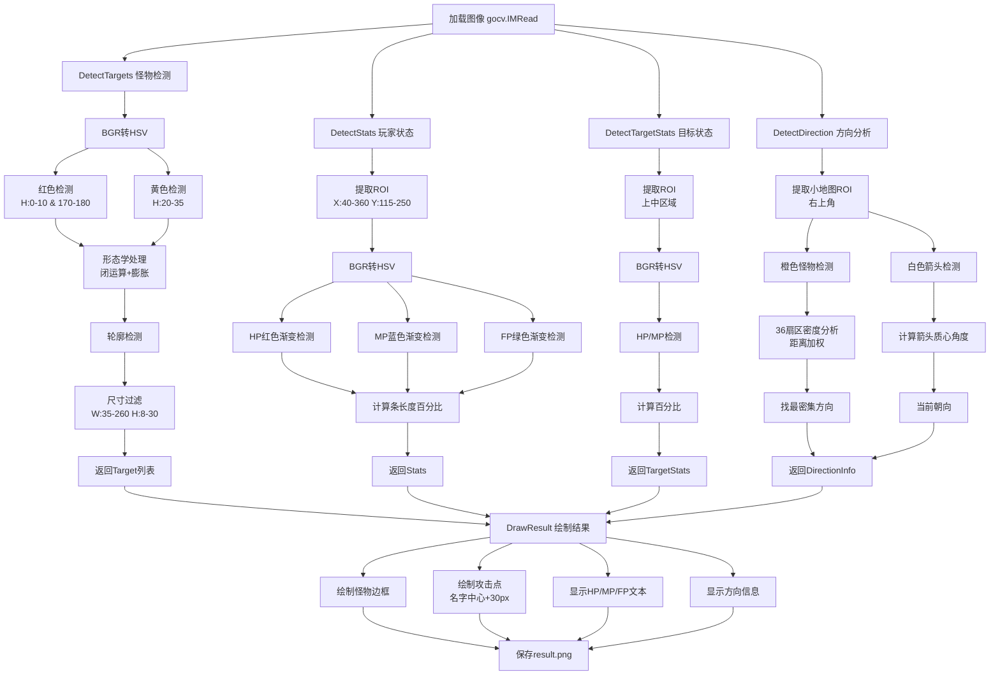

# 图像识别方法说明

## 实现版本说明

本项目提供了两个版本的实现：

### 1. **gocv版本 (main.go)** - 推荐使用
- 使用OpenCV计算机视觉库 (通过gocv绑定)
- 支持HSV色彩空间转换，对光照变化更鲁棒
- 使用形态学操作和轮廓检测，识别更精准
- 支持渐变色检测
- 依赖: gocv.io/x/gocv, OpenCV 4.x

### 2. **标准库版本 (main.go.backup)**
- 仅使用Go标准库 (image, image/color等)
- 基于RGB颜色阈值和栅格聚合
- 无外部依赖，部署简单
- 性能略快但精度较低

---

## 总体思路 (gocv版本)
1. 读取 `train.png`，加载为OpenCV Mat格式
2. 转换到HSV色彩空间以获得更好的颜色分离
3. 使用颜色范围检测和形态学操作识别怪物名字
4. 在UI固定区域内检测HP/MP/FP血条的渐变色并计算百分比
5. 分析小地图中的怪物分布和玩家朝向
6. 使用OpenCV绘图函数在原图上标注结果并输出 `result.png`

## 关键算法流程 (gocv版本)



## 颜色阈值 (HSV色彩空间 - gocv版本)

### 怪物名字检测
- **红色 (攻击性怪物)**:
  - 范围1: H: 0-10°, S: 80-255, V: 80-255
  - 范围2: H: 170-180°, S: 80-255, V: 80-255
  - 说明: 红色在HSV中跨越0度，需要两个范围

- **黄色 (被动怪物)**:
  - H: 20-35°, S: 100-255, V: 150-255

### 血条/蓝条/绿条检测 (支持渐变)
- **HP条 (红色渐变)**:
  - 亮红: H: 0-10°, S: 100-255, V: 150-255
  - 暗红: H: 170-180°, S: 100-255, V: 100-255

- **MP条 (蓝色渐变)**:
  - 亮蓝: H: 100-130°, S: 80-255, V: 120-255
  - 暗蓝: H: 95-110°, S: 50-200, V: 100-240

- **FP条 (绿黄渐变)**:
  - 黄绿: H: 25-45°, S: 80-255, V: 150-255
  - 纯绿: H: 40-80°, S: 50-255, V: 100-255

### 小地图检测
- **橙色怪物点**:
  - H: 5-25°, S: 100-255, V: 150-255

- **白色箭头 (玩家朝向)**:
  - H: 0-180°, S: 0-30, V: 200-255

### HSV色彩空间说明
- **H (Hue 色相)**: 0-180° (OpenCV中), 表示颜色类型
  - 红色: 0-10° & 170-180°
  - 黄色: 20-35°
  - 绿色: 40-80°
  - 蓝色: 100-130°

- **S (Saturation 饱和度)**: 0-255, 表示颜色纯度
  - 高饱和度 (100-255): 鲜艳颜色
  - 低饱和度 (0-50): 接近灰色/白色

- **V (Value 亮度)**: 0-255, 表示明暗程度
  - 高亮度 (150-255): 明亮
  - 低亮度 (0-100): 暗淡

---

## 颜色阈值 (RGB色彩空间 - 标准库版本)
- 怪物名字：
  - 红色：`R ≥ 180, 40 ≤ G ≤ 160, 20 ≤ B ≤ 160, R > G + 40`
  - 黄色：`R ≥ 200, G ≥ 180, B ≤ 150`
- HP 条：`R ≥ 170, G < 130, B < 130`
- MP 条：`B ≥ 150, G ≥ 120, R < 160`
- FP 条：`R ≥ 200, G ≥ 120, B < 120`
- 小地图：
  - 玩家箭头：`R,G,B > 240`
  - 怪物点：`R > 200, 120 < G < 220, B < 150`

## 优化与鲁棒性 (gocv版本)

### 颜色检测优化
- **HSV色彩空间**: 相比RGB对光照变化更鲁棒
- **渐变色支持**: 使用多个颜色范围并合并掩码
- **形态学操作**:
  - 闭运算 (MorphClose): 填充文字间小缝隙
  - 膨胀 (Dilate): 连接相邻字符

### 目标检测优化
- **轮廓检测**: 使用OpenCV的FindContours精准提取连通区域
- **尺寸过滤**: 根据实际游戏UI尺寸过滤噪点
  - 怪物名字: 35-260px × 8-30px
- **ROI裁剪**: 只处理感兴趣区域，减少计算量

### 方向分析优化
- **扇区密度分析**: 36个扇区 (每个10度)
- **距离加权**: `weight = 1.0 / (1.0 + distance/20.0)`
  - 近距离怪物权重更高
  - 减弱远端噪声影响

### 性能优化
- **延迟释放**: 使用`defer`自动管理Mat对象内存
- **小核处理**: 形态学使用小核(3x3, 5x3)减少计算
- **单次遍历**: 尽可能在一次循环中完成多个任务

### 算法鲁棒性
- **颜色范围容差**: 设置合理的HSV范围覆盖渐变
- **百分比上限**: 限制在100%以内防止异常值
- **空值检查**: 对未检测到的目标返回空值/false
- **边界检查**: 确保ROI不超出图像边界

---

## 优化与鲁棒性 (标准库版本)
- 栅格大小 40px，配合 ±25px 搜索半径对抗文字断裂或浮动
- 列密度归一化求比值，可适应渐变填充
- 小地图怪物角度按距离加权，减弱远端噪声影响
- 自实现 5x7 字体渲染，避免额外依赖并支持离线运行

---

## 性能对比

| 指标 | gocv版本 | 标准库版本 |
|------|---------|----------|
| 识别精度 | ⭐⭐⭐⭐⭐ | ⭐⭐⭐⭐ |
| 处理速度 | ⭐⭐⭐⭐ | ⭐⭐⭐⭐⭐ |
| 鲁棒性 | ⭐⭐⭐⭐⭐ | ⭐⭐⭐ |
| 依赖复杂度 | ⭐⭐⭐ | ⭐⭐⭐⭐⭐ |
| 渐变色支持 | ✅ 完整 | ⚠️ 有限 |
| 形态学操作 | ✅ 支持 | ❌ 不支持 |
| 轮廓检测 | ✅ 精准 | ⚠️ 近似 |

---

## 使用方法

### 安装依赖 (gocv版本)
```bash
# macOS
brew install opencv pkg-config

# 安装gocv
go get -u gocv.io/x/gocv
go mod tidy
```

### 运行程序
```bash
# 运行gocv版本
go run main.go

# 运行标准库版本
go run main.go.backup
```

### 输出
程序会生成 `result.png` 文件，包含所有检测结果的可视化标注。
